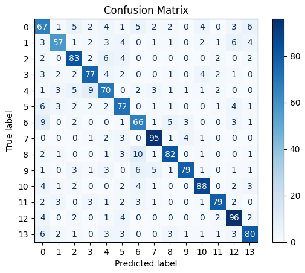
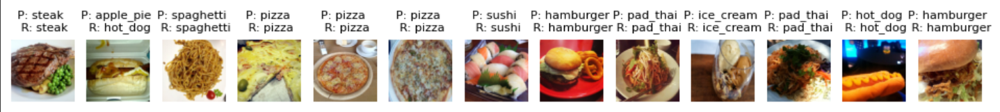
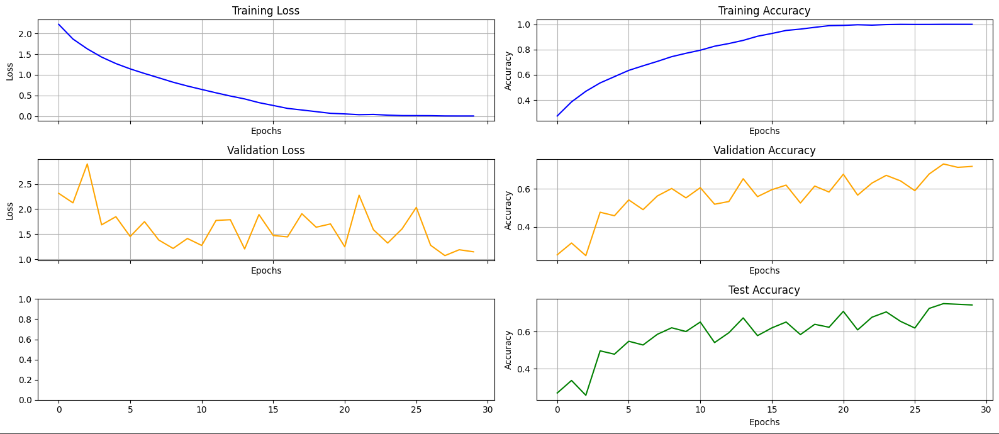

# Matematikai-Programcsomagok

# Projekt: Konvolúciós neurális hálózat 
# Készítette: Merencsics Martin Marcell, Rákosy Dominik, Szeidemann Márton

## Előnézet:
Projektünkben egy kezdő klasszifikációs modellt építettünk fel, főként a PyTorch és NumPy könyvtárak segítségével. Modellünket körülbelül 14 000 darab, 224×224‑es felbontású ételfotón (FOOD‑14 adathalmaz) tanítottuk, 14 különböző kategóriára.

A kód megírásához a Google Colab (Jupyter Notebook) felületét használtuk, mert a tanítófázis futtatásának felgyorsításához igénybe vettük a rendszeren keresztül ingyenesen elérhető GPU‑t, és a kollaboratív munka is egyszerűbb volt.

30 epochos tanítás után a végső modell 76 % pontosságot ért el (azaz egy számára ismeretlen tesztképen körülbelül 76 % eséllyel mondta meg helyesen, hogy mi látható rajta).

## A README további részében megtalálod:

- használati utasítást a program saját használatra való beüzemeléséhez,
  
- a teljes notebookhoz vezető linket,

- egy képtesztelő interface-t,

- a program felépítésének rövid vázlatát,

- a modell tanítási és kiértékelési fázisának legfontosabb statisztikáit,

- valamint az általunk használt segédanyagok listáját.

#### Előfeltételek:

- Python 3.10 vagy újabb

- PyTorch 2.0 vagy újabb (CUDA 11.x, ha GPU‑t használsz)

- NumPy

- scikit‑learn (kiértékeléshez, például confusion matrix)

- matplotlib és seaborn (grafikonokhoz)

- tqdm (progress‑bar‑ok)

#### Modell és eredmények:
- Architektúra: 10 konvolúciós réteg, max‑pool, batch norm és ReLU blokkok, majd 2 fully‑connected réteg; a kimenet 14 neuronos softmax.
- Paraméterek: kb. 9,6 millió 
- Optimalizáló: AdamW (tanulási ráta 1e‑4, weight_decay 1e‑2)
- Learning‑rate scheduler: exponenciális (gamma 0,95 epochonként)
- Early Stopping: patience 10, legjobb checkpoint models/cnn.pt
- Batch size: 64
- Bemeneti normalizálás: RGB képek, torchvision.transforms.Normalize([0.5, …])

#### Vázlatos felépítése:
- Képek feltöltése
- Adathalmazok létrehozása 
- A konvolúciós neurális háló (CNN) definiálása
- Előkészületek a tanításhoz/futtatókörnyezet és optimalizáló beállítása
- Tanítás
- Kiértékelés 
- Statisztika

#### Futtatás és használat (Google Colabban):
  1. Nyisd meg a Google Colab linket és jelentkezz be egy Google Drive fiókba.
  2. Futtasd az 1-6. és a 9. cellákat.
     - Ha új modellt szeretnél létrehozni, akkor futtasd a 7. cellát, majd kezdheted a 10. cella futtatásával a tanítást.
     - Ha a meglévő modelled szeretnéd használni (például kiértékelni vagy továbbtanítani), akkor töltsd fel annak elérési útvonalát a Google Drive meghajtódra, majd a 8. cellában helyettesítsd a példába a megfelelő         linket.
  3. A 11. cella futtatásával kiértékelheted a modelledet.
  4. A 12. és 14. pont alatti cellák futtatásával plotolhatsz a modelledről készült diagramok.
  5. A 13. pont alatti cellában elmentheted a modelledet. A shutil.copy függvény első argumentumában add meg a modelled nevét (.pt fájlformátumban), majd annak elérési útvonalát Drive-on. 
  6. :)

### A kód elérési linkje: 
https://colab.research.google.com/drive/1vRqt2sXcfFtVR7j0cl4WLBtNMiMATbqg#scrollTo=eIOFKIQNOl1r

### Képtesztelő:
https://colab.research.google.com/drive/1yzO-0z7EjpMd_zm0_lEMssianC9PbVro#scrollTo=YXVFuCjYQGip

Confusion matrix:

Predikciók az első 13 tesztképre:

Loss és accuracy változása:

### Segédanyagok listája:
- FOOD-14 adathalmaz: https://data.vision.ee.ethz.ch/cvl/datasets_extra/food-101/?fbclid=IwZXh0bgNhZW0CMTEAAR4HHFEoVWwEQuy70Z4Aq69MbNzZw8pHLFlpfj4G-Omh-_5FWWVTO4a8S24AjA_aem_fsRZYGFsvNDhdtYHCDkWVg
- A Pytorch dokumentációja: https://pytorch.org/docs/stable/index.html
- Rácz Dániel előadás-sorozata: https://github.com/DamasdiGabor/matprog2024-25/blob/main/MATPROG_Eloadas_6es7.pdf
- Iván által összeállított gyakorlati segédanyag: https://colab.research.google.com/drive/18JwxaWra64n_LHgA1oOuF2pxozM6n8jE
- ChatGPT
